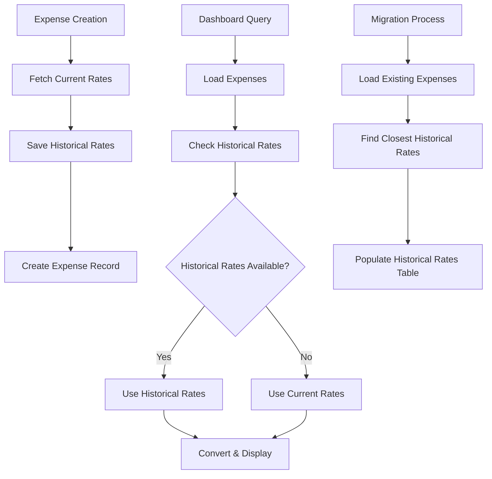
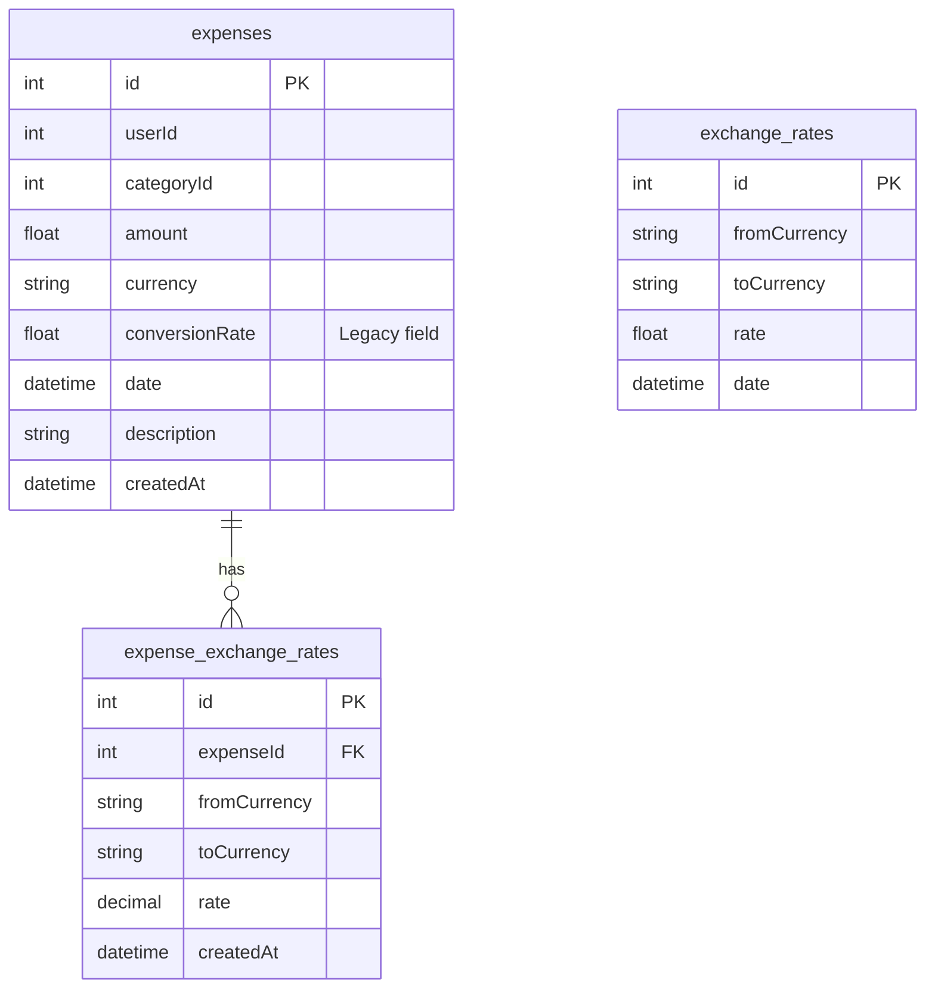

# Design Document

## Overview

Questo documento descrive il design per risolvere il bug di conversione valutaria storica nell'applicazione Expenses Tracker. La soluzione implementa un sistema di "congelamento" dei tassi di cambio al momento della registrazione delle spese, garantendo accuratezza storica nelle conversioni future.

Il design mantiene la compatibilità retroattiva con il sistema esistente mentre introduce una nuova architettura per la gestione dei tassi storici, includendo strategie di migrazione per i dati esistenti e meccanismi di fallback robusti.

## Architecture

### High-Level Architecture



### Database Architecture

La soluzione introduce una nuova tabella `expense_exchange_rates` che mantiene una relazione one-to-many con la tabella `expenses` esistente:



## Components and Interfaces

### 1. Database Schema Extensions

**New Table: `expense_exchange_rates`**
```prisma
model ExpenseExchangeRate {
  id           Int      @id @default(autoincrement())
  expenseId    Int
  fromCurrency String   @db.VarChar(3)
  toCurrency   String   @db.VarChar(3)
  rate         Decimal  @db.Decimal(15,8)
  createdAt    DateTime @default(now())
  
  expense      Expense  @relation(fields: [expenseId], references: [id], onDelete: Cascade)
  
  @@unique([expenseId, fromCurrency, toCurrency])
  @@index([expenseId])
  @@index([fromCurrency, toCurrency])
  @@map("expense_exchange_rates")
}
```

**Updated Expense Model**
```prisma
model Expense {
  // ... existing fields
  historicalRates ExpenseExchangeRate[]
}
```

### 2. Core Services

**HistoricalRateService**
```typescript
interface HistoricalRateService {
  saveRatesForExpense(expenseId: number, expenseDate: Date): Promise<void>
  getHistoricalRate(expenseId: number, fromCurrency: string, toCurrency: string): Promise<number | null>
  convertWithHistoricalRate(amount: number, fromCurrency: string, toCurrency: string, expenseId?: number): Promise<number>
  migrateExistingExpenses(): Promise<MigrationResult>
}
```

**Enhanced Currency Service**
```typescript
interface EnhancedCurrencyService {
  fetchRatesForDate(date: Date): Promise<Map<string, Map<string, number>>>
  findClosestHistoricalRate(fromCurrency: string, toCurrency: string, targetDate: Date): Promise<ExchangeRate | null>
  getAllSupportedCurrencies(): string[]
}
```

### 3. tRPC Procedure Updates

**Enhanced createExpense**
```typescript
export const createExpense = protectedProcedure
  .input(createExpenseSchema)
  .mutation(async ({ ctx, input }) => {
    // Create expense (existing logic)
    const expense = await db.expense.create({...});
    
    // NEW: Save historical rates
    await historicalRateService.saveRatesForExpense(expense.id, expense.date);
    
    return expense;
  });
```

**Enhanced Dashboard Conversions**
```typescript
const convertCurrencyWithHistory = async (
  amount: number, 
  fromCurrency: string, 
  toCurrency: string, 
  expenseId?: number
): Promise<number> => {
  if (expenseId) {
    const historicalRate = await historicalRateService.getHistoricalRate(
      expenseId, fromCurrency, toCurrency
    );
    if (historicalRate) {
      return amount * historicalRate;
    }
  }
  
  // Fallback to current conversion logic
  return convertCurrency(amount, fromCurrency, toCurrency);
};
```

## Data Models

### ExpenseExchangeRate Model
```typescript
interface ExpenseExchangeRate {
  id: number;
  expenseId: number;
  fromCurrency: string;
  toCurrency: string;
  rate: number;
  createdAt: Date;
}
```

### Enhanced Expense Model
```typescript
interface EnhancedExpense extends Expense {
  historicalRates?: ExpenseExchangeRate[];
  convertedAmount?: number;
  conversionRate?: number;
  targetCurrency?: string;
}
```

### Migration Result Model
```typescript
interface MigrationResult {
  totalExpenses: number;
  migratedExpenses: number;
  skippedExpenses: number;
  errors: string[];
  duration: number;
}
```

## Error Handling

### Error Types
```typescript
enum HistoricalRateError {
  RATE_NOT_FOUND = 'HISTORICAL_RATE_NOT_FOUND',
  API_UNAVAILABLE = 'EXCHANGE_API_UNAVAILABLE',
  INVALID_CURRENCY = 'INVALID_CURRENCY_CODE',
  DATABASE_ERROR = 'DATABASE_OPERATION_FAILED'
}
```

### Error Handling Strategy

1. **Graceful Degradation**: Se i tassi storici non sono disponibili, utilizza tassi correnti
2. **Retry Logic**: Implementa retry per chiamate API fallite durante il salvataggio tassi
3. **Logging Dettagliato**: Registra tutti gli errori per debugging e monitoraggio
4. **User Feedback**: Fornisce indicazioni chiare quando vengono usati tassi di fallback

### Fallback Hierarchy
```typescript
const getExchangeRate = async (fromCurrency: string, toCurrency: string, expenseId?: number): Promise<number> => {
  try {
    // 1. Try historical rate for specific expense
    if (expenseId) {
      const historicalRate = await getHistoricalRate(expenseId, fromCurrency, toCurrency);
      if (historicalRate) return historicalRate;
    }
    
    // 2. Try current rate from database
    const currentRate = await getCurrentRate(fromCurrency, toCurrency);
    if (currentRate) return currentRate;
    
    // 3. Try fetching from API
    const apiRate = await fetchFromAPI(fromCurrency, toCurrency);
    if (apiRate) return apiRate;
    
    // 4. Use hardcoded fallback rates
    return getFallbackRate(fromCurrency, toCurrency);
  } catch (error) {
    logger.error('Exchange rate lookup failed', { fromCurrency, toCurrency, expenseId, error });
    return getFallbackRate(fromCurrency, toCurrency);
  }
};
```

## Testing Strategy

### Unit Tests
- **HistoricalRateService**: Test salvataggio e recupero tassi storici
- **Currency Conversion**: Test logica di conversione con e senza tassi storici
- **Fallback Logic**: Test comportamento quando tassi storici non disponibili
- **Migration Logic**: Test migrazione dati esistenti

### Integration Tests
- **Database Operations**: Test CRUD operations su expense_exchange_rates
- **tRPC Procedures**: Test procedure aggiornate con tassi storici
- **API Integration**: Test integrazione con API esterne per tassi

### End-to-End Tests
- **Expense Creation Flow**: Test completo creazione spesa con salvataggio tassi
- **Dashboard Display**: Test visualizzazione spese convertite con tassi storici
- **Migration Process**: Test processo di migrazione completo

### Performance Tests
- **Query Performance**: Test performance query con grandi volumi di tassi storici
- **Conversion Speed**: Test velocità conversioni con tassi storici vs correnti
- **Memory Usage**: Test utilizzo memoria durante operazioni batch

## Migration Strategy

### Phase 1: Schema Migration
```sql
-- Create new table
CREATE TABLE expense_exchange_rates (
  id SERIAL PRIMARY KEY,
  expense_id INTEGER NOT NULL REFERENCES expenses(id) ON DELETE CASCADE,
  from_currency VARCHAR(3) NOT NULL,
  to_currency VARCHAR(3) NOT NULL,
  rate DECIMAL(15,8) NOT NULL,
  created_at TIMESTAMP DEFAULT NOW(),
  CONSTRAINT unique_expense_currency_pair UNIQUE(expense_id, from_currency, to_currency)
);

-- Create indexes for performance
CREATE INDEX idx_expense_exchange_rates_expense_id ON expense_exchange_rates(expense_id);
CREATE INDEX idx_expense_exchange_rates_currencies ON expense_exchange_rates(from_currency, to_currency);
```

### Phase 2: Data Migration
```typescript
const migrateExistingExpenses = async (): Promise<MigrationResult> => {
  const expenses = await db.expense.findMany({
    orderBy: { date: 'asc' }
  });
  
  let migrated = 0;
  let skipped = 0;
  const errors: string[] = [];
  
  for (const expense of expenses) {
    try {
      // Use existing conversionRate if available
      if (expense.conversionRate && expense.currency !== 'EUR') {
        await db.expenseExchangeRate.create({
          data: {
            expenseId: expense.id,
            fromCurrency: expense.currency,
            toCurrency: 'EUR',
            rate: expense.conversionRate
          }
        });
      }
      
      // Find and save other historical rates
      await populateHistoricalRatesForExpense(expense);
      migrated++;
    } catch (error) {
      errors.push(`Expense ${expense.id}: ${error.message}`);
      skipped++;
    }
  }
  
  return { totalExpenses: expenses.length, migrated, skipped, errors };
};
```

### Phase 3: Code Deployment
1. Deploy new schema and migration scripts
2. Run data migration in background
3. Deploy updated application code with feature flags
4. Gradually enable historical rate features
5. Monitor performance and error rates

## Performance Considerations

### Database Optimization
- **Indexes**: Ottimizzati per query frequenti (expense_id, currency pairs)
- **Partitioning**: Considera partitioning per tabella exchange_rates per date
- **Connection Pooling**: Ottimizza pool connections per operazioni batch

### Caching Strategy
```typescript
interface RateCache {
  getHistoricalRate(expenseId: number, fromCurrency: string, toCurrency: string): Promise<number | null>;
  setHistoricalRate(expenseId: number, fromCurrency: string, toCurrency: string, rate: number): Promise<void>;
  invalidateExpenseRates(expenseId: number): Promise<void>;
}
```

### Batch Operations
- **Rate Fetching**: Batch API calls per multiple currency pairs
- **Database Writes**: Use transactions per multiple rate inserts
- **Migration**: Process expenses in batches to avoid memory issues

## Security Considerations

### Data Validation
- **Currency Codes**: Validate against supported currency list
- **Rate Values**: Validate reasonable rate ranges (0.0001 to 10000)
- **Date Validation**: Ensure expense dates are not in future

### Access Control
- **User Isolation**: Ensure users can only access their own expense rates
- **API Rate Limiting**: Implement rate limiting for external API calls
- **Audit Logging**: Log all rate modifications for audit trail

### Data Integrity
- **Referential Integrity**: Foreign key constraints prevent orphaned rates
- **Unique Constraints**: Prevent duplicate rates for same expense/currency pair
- **Transaction Safety**: Use database transactions for atomic operations